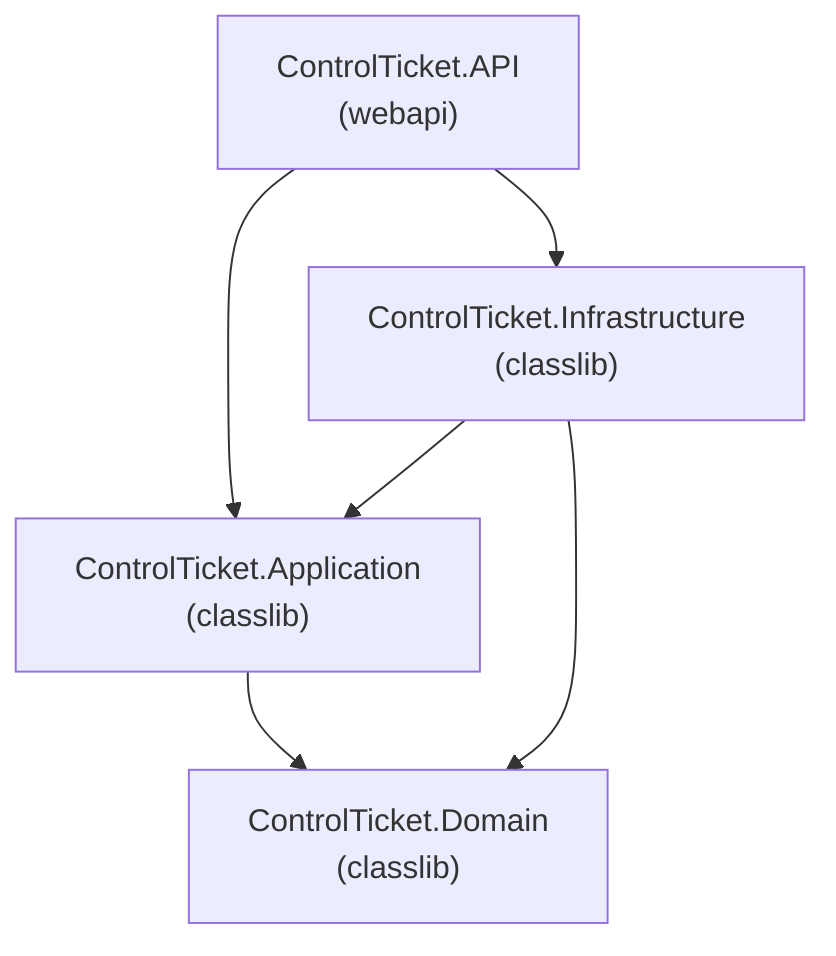

# ControlTicket

A pragmatic **Clean Architecture** .NET 9 solution following DDD essentials — structured for clarity without unnecessary over-engineering.

---

## Requirements

- [.NET 9 SDK](https://dotnet.microsoft.com/download/dotnet/9.0) (v9.0 or later)
- A code editor (Visual Studio 2022, VS Code, Rider, etc.)

---

## Walkthrough

### Architecture



**Dependency rule** — arrows point inward:

| Layer | Depends on | Role |
|---|---|---|
| **Domain** | Nothing | Entities, value objects, repository contracts |
| **Application** | Domain | Use cases, service interfaces, DTOs |
| **Infrastructure** | Application + Domain | Implements interfaces (DB, external APIs) |
| **API** | Application + Infrastructure | Entry point, controllers, DI wiring |

### Directory structure

```
ControlTicket.sln
│
├── ControlTicket.Domain/
│   └── Common/
│       ├── BaseEntity.cs             ← abstract entity (Id, CreatedAt, UpdatedAt)
│       └── IRepository.cs            ← generic CRUD interface
│
├── ControlTicket.Application/
│   ├── Common/
│   │   └── IApplicationDbContext.cs  ← DB context abstraction
│   └── DependencyInjection.cs        ← AddApplication() extension
│
├── ControlTicket.Infrastructure/
│   └── DependencyInjection.cs        ← AddInfrastructure() extension
│
└── ControlTicket.API/
    ├── Controllers/
    │   └── WeatherForecastController.cs
    ├── Program.cs                    ← wires all layers via DI
    ├── WeatherForecast.cs
    └── appsettings.json
```

### Key files

| Layer | File | Purpose |
|---|---|---|
| Domain | `Common/BaseEntity.cs` | Identity + audit timestamps for all entities |
| Domain | `Common/IRepository.cs` | Generic CRUD contract |
| Application | `Common/IApplicationDbContext.cs` | DB context abstraction |
| Application | `DependencyInjection.cs` | `AddApplication()` DI extension |
| Infrastructure | `DependencyInjection.cs` | `AddInfrastructure()` DI extension |
| API | `Program.cs` | Entry point — calls both DI extensions |

### How to run

```bash
# Build the solution
dotnet build ControlTicket.sln

# Run the API
dotnet run --project ControlTicket.API
```

The API will start and you can test the sample endpoint at `GET /weatherforecast`.
